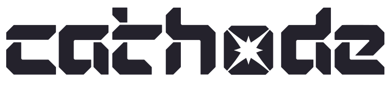
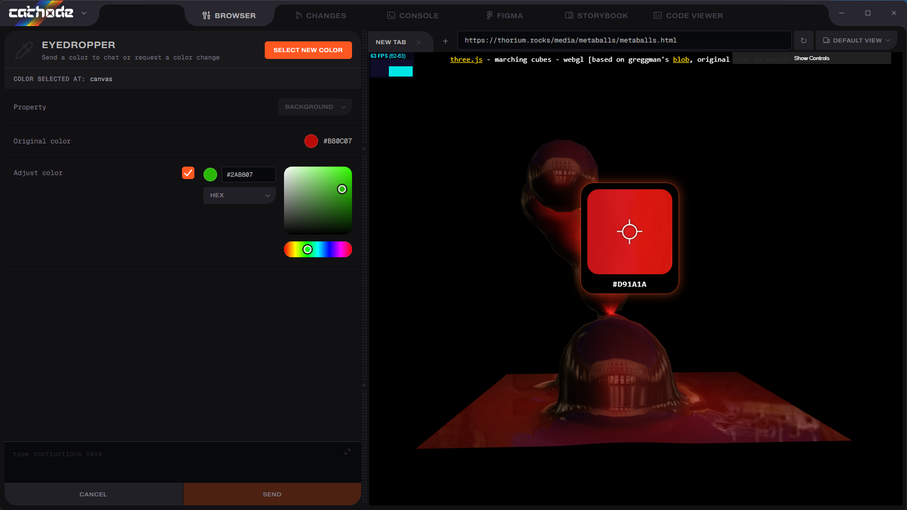
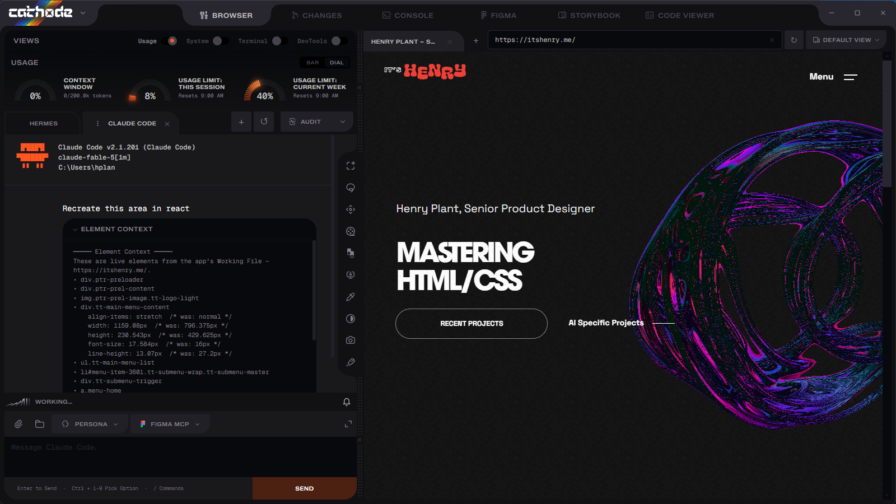
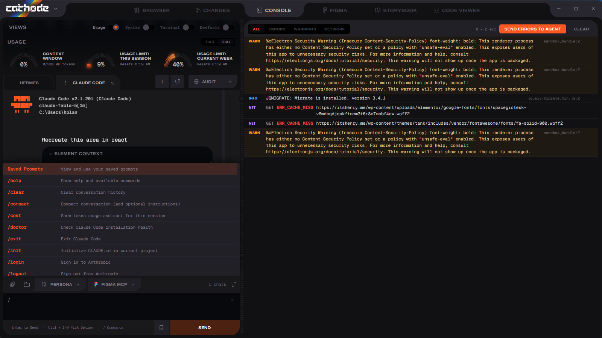

<div align="center">
  <picture>
    <source media="(prefers-color-scheme: dark)" srcset="docs/cathode-logo.svg" />
    
  </picture>
  <h1>Cathode Terminal</h1>
  <p><strong>A split chat + browser dev tool for AI coding agents.</strong></p>
  <p>
    Pair Claude Code, Codex, Gemini, or Hermes with an embedded browser and
    point them at live pages — inspect elements, pick components, capture screenshots,
    and hand context straight to your agent.
  </p>

  [](LICENSE)
  [](https://github.com/hplant6/cathode-terminal/releases)
  
</div>

---

## Why Cathode?

I built Cathode Terminal out of sheer frustration with current AI coding tools. Translating visual intuition and HTML structure into endless text prompts was completely draining my creative energy. Cathode is designed to fix that: **it requires less typing while delivering much higher precision to your AI agents.** By eliminating design drift, enforcing strict UI consistency, and offering clear visibility into your daily limits, Cathode accelerates your workflow — helping you ship production-ready code faster while keeping your credit budget intact.

## Screenshot



## Features

- **Split workspace** — an AI coding agent on the left, an embedded Chromium browser on the right, resizable.
- **Multiple agents** — Claude Code, OpenAI Codex CLI, Gemini CLI, and Hermes, all speaking the Agent Client Protocol for a rich chat UI.
- **Page-inspection tools** — Box/Lasso select, Pick component, Extract, Eyedropper, Resize, Animate, Accessibility, Screenshot, and Draw. Target any element on a live page and send it to your agent.
- **Embedded DevTools** — inspect the browsed page without leaving the app.
- **Live gauges** — context-window fill and your Claude usage limits (5-hour / weekly) as real-time dials.
- **System panel** — CPU / RAM / GPU meters plus a top-process breakdown.
- **Integrated terminal** — a full xterm terminal per session; toggle any session between chat and terminal.
- **Design-system aware** — connect a Storybook to insert components, and a Figma MCP for design context.
- **Audits & code review** — run audits and review changes in-app.
- **Theming** — a shade-based theme engine with presets.



## The tools

Everything Cathode gives you, straight from the in-app **Meet the tools** tour.

### Workspace

| Tool | What it does |
| --- | --- |
| **Browser** | Target a live site or local dev server to inspect & edit with your agent. |
| **Storybook** | Pick a design-system component to insert at a targeted location on the page. |
| **Usage** | Context-window fill and your 5-hour / weekly Claude limits as live gauges. |

### Page tools (toolbar)

| Tool | Shortcut | What it does |
| --- | --- | --- |
| **Box select** | `B` | Draw a box to select page elements and send them to chat. |
| **Lasso select** | `L` | Freehand-select page elements. |
| **Resize** | `R` | Resize an element directly on the page. |
| **Animate** | `N` | Target an element and build an animation request (type, easing, timing) for chat. |
| **Pick component** | `S` | Pick a Storybook design-system component on the page. |
| **Extract** | `E` | Extract a page element for your agent. |
| **Eyedropper** | `C` | Sample any color with a magnifier loupe, then edit it live or send it to chat. |
| **Accessibility** | `A` | Scan the page for WCAG contrast failures and a11y issues, then send them to chat to fix. |
| **Screenshot** | `I` | Capture a region of the page for the agent. |
| **Draw** | `M` | Annotate the page with a marker, then hand it over. |

### Panel controls

| Tool | What it does |
| --- | --- |
| **Audit** | Run a code audit — pick an audit type from the dropdown. |
| **Chat / Terminal** | Toggle a Claude session between chat view and the raw terminal. |
| **Inspect (DevTools)** | Open the embedded DevTools panel for the page. |



## Requirements

- **Windows** — [WSL 2](https://learn.microsoft.com/windows/wsl/install); agents run inside the Linux environment.
- **macOS / Linux** — agents run in your native login shell.
- **At least one agent CLI** — Claude Code, Codex, Gemini, or Hermes. Cathode's first-run setup helps install what's missing.

## Install

Grab the latest build for your platform from the [**Releases**](https://github.com/hplant6/cathode-terminal/releases) page:

| Platform | Files |
| --- | --- |
| **Windows** | `.exe` installer or portable `.exe` |
| **macOS** | `.dmg` (Apple Silicon + Intel) |
| **Linux** | `.AppImage`, `.deb`, or `.tar.gz` |

> On first launch, Cathode walks you through installing WSL (on Windows) and your chosen agent.

## Quick start

1. Launch Cathode and complete setup for your agent.
2. Enter a URL or `localhost:3000` in the browser bar to load a site or local dev server.
3. Use a toolbar tool to select an element, then send it to your agent in the chat.
4. Toggle a session between **chat** and **terminal**, or open the embedded **DevTools**.

## Supported agents

| Agent | Mode | Description |
| --- | --- | --- |
| **Claude Code** | Chat (ACP) | Anthropic's coding agent CLI — the default agent. |
| **OpenAI Codex CLI** | Chat (ACP) | OpenAI's AI coding agent for the terminal. |
| **Gemini CLI** | Chat (ACP) | Google's AI assistant for the command line. |
| **Hermes** | Chat (ACP) | Nous Research's agentic CLI. |

Install, add, or remove agents any time from **Manage LLMs**.

## Build from source

```bash
git clone https://github.com/hplant6/cathode-terminal.git
cd cathode-terminal
npm install
npm start
```

Package installers:

```bash
npm run dist:win     # Windows  — .exe + portable
npm run dist:mac     # macOS    — .dmg + .zip (arm64 + x64)
npm run dist:linux   # Linux    — .AppImage + .deb + .tar.gz
```

> macOS and Linux targets must be built on that OS (native toolchain required). The
> [release workflow](.github/workflows/release.yml) builds all three on their own
> runners when you push a `v*` tag.

## Tech stack

Electron · [node-pty](https://github.com/microsoft/node-pty) · [xterm.js](https://xtermjs.org) · [Monaco](https://microsoft.github.io/monaco-editor/) · [Agent Client Protocol](https://agentclientprotocol.com) · a bundled Storybook design system.

## Contributing

Contributions are welcome. Clone, `npm install`, `npm start` (see [Build from source](#build-from-source)), and open a PR. Found a bug or have an idea? Open an [issue](https://github.com/hplant6/cathode-terminal/issues).

## License

[MIT](LICENSE) © hplan
